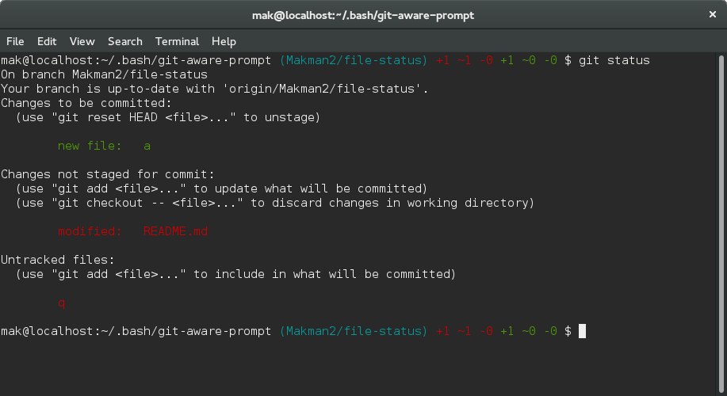

# Git Aware Prompt

Working with Git and its great branching/merging features is
amazing. Constantly switching branches can be confusing though as you have to
run `git status` to see which branch you're currently on.

The solution to this is to have your terminal prompt display the current
branch. There's a [number][1] [of][2] [articles][3] [available][4] online
about how to achieve this. This project is an attempt to make an easy to
install/configure solution.

[1]: http://aaroncrane.co.uk/2009/03/git_branch_prompt/
[2]: http://railstips.org/2009/2/2/bedazzle-your-bash-prompt-with-git-info
[3]: http://techblog.floorplanner.com/2008/12/14/working-with-git-branches/
[4]: http://www.intridea.com/2009/2/2/git-status-in-your-prompt


## Overview

If you `cd` to a Git working directory, you will see the current Git branch
name displayed in your terminal prompt. When you're not in a Git working
directory, your prompt works like normal.


git-aware-prompt contains an "extended" mode, that displays more information.




## Installation

Clone the project to a `.bash` folder in your home directory:

```bash
mkdir ~/.bash
cd ~/.bash
git clone git://github.com/jimeh/git-aware-prompt.git
```

And just install it:

```bash
cd git-aware-prompt
./install
```

This install git-aware-prompt only in *SIMPLE* mode. If you want to use
*EXTENDED* mode, see **Configuring** below.


## Configuring

Once installed, there will be new `$git_branch` and `$git_dirty` variables
available to use in the `PS1` environment variable, along with a number of
color helper variables which you can see a list of in [colors.sh][].

[colors.sh]: https://github.com/jimeh/git-aware-prompt/blob/master/colors.sh

git-aware-prompt implements an *EXTENDED* mode. Setting *EXTENDED* mode from
install script is currently not supported and needs to be done manually. To do
so go to `~/.bashrc` and change `GITAWAREPROMPT_MODE` to `EXTENDED`.

Other exported variables are (used from *EXTENDED* mode):

- `$git_unstaged_added_files`
  The number of new files not staged.
- `$git_unstaged_changed_files`
  The number of files where changes are unstaged.
- `$git_unstaged_removed_files`
  The number of removed files unstaged.
- `$git_staged_added_files`
  The number of new files staged.
- `$git_staged_changed_files`
  The number of files where changes are staged.
- `$git_staged_removed_files`
  The number of removed files staged.
- `$git_renamed_files`
  The number of renamed files.

If you want to know more about how to customize your prompt, I recommend
this article: [How to: Change / Setup bash custom prompt (PS1)][how-to]

[how-to]: http://www.cyberciti.biz/tips/howto-linux-unix-bash-shell-setup-prompt.html


### Implement your own git-aware-prompt

If you want to modify the prompt, look at `setPS1.sh` inside the
`update_git_PS1` function. There you can customize `PS1` like you need.


## Updating

Assuming you followed the default installation instructions and cloned this
repo to `~/.bash/git-aware-prompt`:

```bash
cd ~/.bash/git-aware-prompt
git pull
```


## Usage Tips

To view other user's tips, please check the
[Usage Tips](https://github.com/jimeh/git-aware-prompt/wiki/Usage-Tips) wiki
page. Or if you have tips of your own, feel free to add them :)


## License

[CC0 1.0 Universal](http://creativecommons.org/publicdomain/zero/1.0/)
